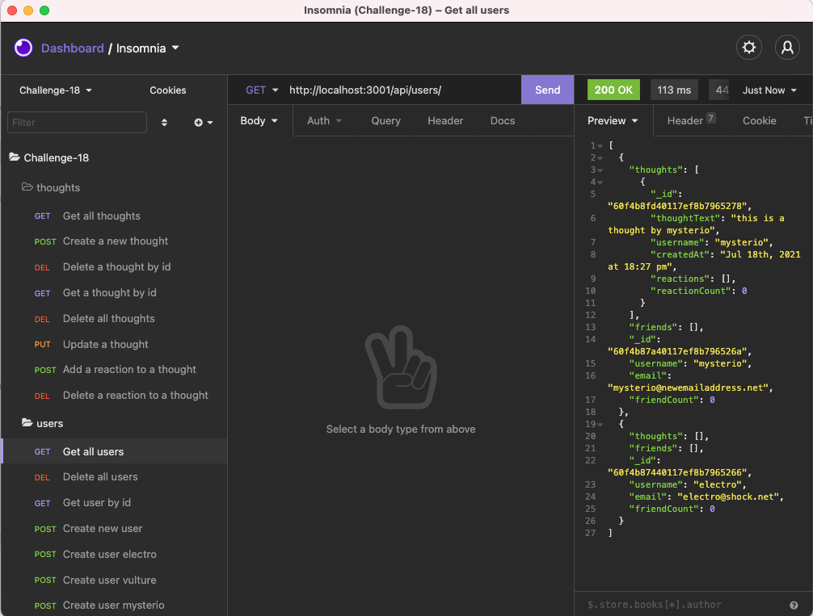

# **Bryan Godwin - Week 18 Challenge**

## **Social Network API**

### This challenge is to build an API for a social network web application

This app uses the following technologies:

- Express.js for routing
- MondoDB database
- Mongoose ODM

Only the back-end API is implemented, functionality is demo'd using Insomnia Core

### **User Story**

    AS A social media startup
    I WANT an API for my social network that uses a NoSQL database
    SO THAT my website can handle large amounts of unstructured data

### **Acceptance Critera**

1.  Application can be started from command line

    WHEN I enter the command to invoke the application
    THEN my server is started and the Mongoose models are synced to the MongoDB database

2.  API route to get Users & Thoughts

    WHEN I open API GET routes in Insomnia Core for users and thoughts
    THEN the data for each of these routes is displayed in a formatted JSON

3.  API routes for POST, PUT & DELETE Users and Thoughts

    WHEN I test API POST, PUT, and DELETE routes in Insomnia Core
    THEN I am able to successfully create, update, and delete users and thoughts in my database

4.  Reactions can be added or deleted to Thoughts, and Friends can be added or removed from User's friend list

    WHEN I test API POST and DELETE routes in Insomnia Core
    THEN I am able to successfully create and delete reactions to thoughts and add and remove friends to a user’s friend list

### **Challenge 18 - code repository**

<https://github.com/godwinbw/social-network-api>

### **Challenge 18 - screenshots**

### Challenge 18 - link to walkthrough video

<https://streamable.com/de4crk/>
